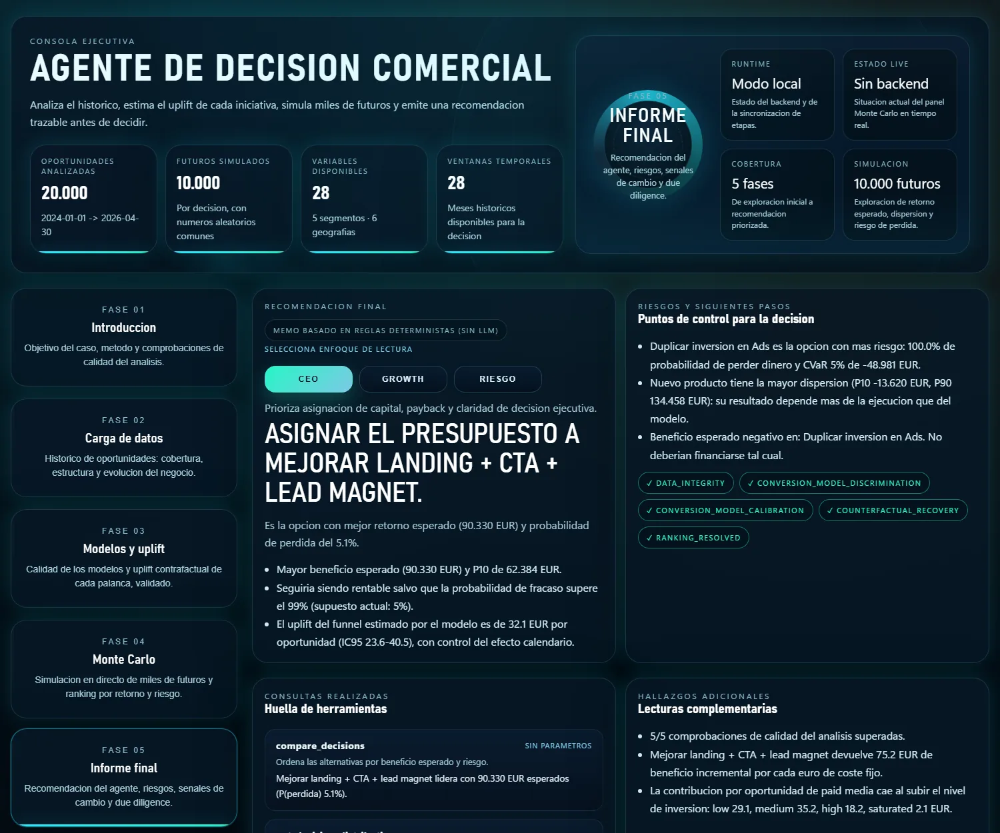

# Monte Carlo Decision Agent

**¿Qué iniciativa de crecimiento debería financiar un negocio?** Este proyecto lo responde
como lo haría un analista riguroso: contrafactuales con ML, una simulación Monte Carlo sobre
todo lo que puede salir mal y un agente de Claude con herramientas que redacta la
recomendación. Después **contrasta sus propias estimaciones con la verdad** de un mundo
sintético. Lo construyó un agente de programación trabajando dentro de un arnés evaluado, que
es el que decide cuándo está terminado el trabajo.

[Dashboard en vivo](https://raulworkacc-dot.github.io/montecarlo-decision-agent/) ·
[Notebook](notebooks/walkthrough.ipynb) ·
[Metodología (EN)](docs/methodology.md) ·
[Arnés (EN)](docs/harness.md) ·
[Read in English](README.md)



## La respuesta, y por qué es fiable

| # | Decisión | Beneficio esperado 6 meses | P10 | P(pérdida) | P(mejor) | P(fracaso) de equilibrio |
|---|---|---:|---:|---:|---:|---:|
| 1 | Mejorar landing + CTA + lead magnet | **90.330 EUR** | 62.384 | 5,1% | 71,4% | 98,8% |
| 2 | Nuevo producto | 52.873 EUR | −13.620 | 36,0% | 25,9% | 88,1% |
| 3 | Webinar de ventas | 30.602 EUR | 9.970 | 9,3% | 2,7% | 93,1% |
| 4 | Duplicar inversión en Ads | −24.878 EUR | −37.188 | 100% | 0,0% | — |

<sub>10.000 futuros simulados por decisión, semilla 42. Informe completo: [docs/results/report.md](docs/results/report.md).</sub>

Tres hallazgos que solo aparecen porque el análisis está validado:

1. **Un modelo ingenuo sobreestima el funnel un 20 %.** Las mejoras del funnel se desplegaron
   mientras la conversión ya subía por sí sola. Al controlar el efecto calendario, el error baja
   a −3,5 % y el efecto real de cada palanca queda dentro de su intervalo bootstrap del 95 %.
2. **Duplicar Ads pierde dinero en todos los futuros.** El paid media ya opera en niveles de
   inversión altos o saturados, y subir un escalón más empeora la calidad y el coste de *todo* el
   tráfico de pago, no solo del volumen extra. Este efecto se estima del histórico, no se supone.
3. **El nuevo producto tiene el mayor potencial y un 36 % de probabilidad de perder dinero.** La
   columna de equilibrio es la probabilidad de fracaso con la que el beneficio esperado de una
   decisión cae a cero ("—": pierde dinero aunque se ejecute siempre con éxito).

## Qué demuestra este proyecto

| Área | En este repositorio |
|---|---|
| **Inferencia causal** | Uplift contrafactual con control temporal, validado contra un DGP conocido; sesgo del modelo ingenuo cuantificado; mediadores (calidad del lead, coste) estimados de los datos |
| **Modelado de riesgo** | Monte Carlo vectorizado con números aleatorios comunes; incertidumbre de modelo, demanda y ejecución; CVaR, P(mejor), análisis de equilibrio, errores estándar MC |
| **Práctica de ML** | Validación temporal, calibración (ECE, Brier), corrección de Duan para el ticket en log, réplicas bootstrap propagadas hasta la decisión |
| **Ingeniería con LLMs** | Bucle de tool use con Claude, esquemas estrictos, turnos acotados, gestión de rechazos y truncado, fallback de modelo en servidor, verdad oculta al agente, modo sin LLM etiquetado |
| **Ingeniería de software** | CLI empaquetada (`mcd`), más de 200 tests (incluida la superficie HTTP), CI en Linux y Windows con Python 3.11/3.13, Dependabot, resultados deterministas por semilla |
| **Seguridad** | Rutas en lista blanca (el original servía `.env`), texto del LLM escapado, escucha en localhost, límite de tamaño en peticiones |
| **Desarrollo asistido por IA** | Arnés agéntico: "hecho" = `just check`, entradas del análisis protegidas, subagente revisor, tareas de referencia evaluadas |

## Puesta en marcha

Requisitos: Python 3.11+, [uv](https://docs.astral.sh/uv/) y [just](https://github.com/casey/just).

```bash
just setup          # instala dependencias
just pipeline       # datos -> modelos -> contrafactuales -> Monte Carlo -> validación (~20 s)
just serve          # Mission Control en http://127.0.0.1:8765, con simulación en directo
```

No hace falta API key: sin ella, el memo lo redacta un autor determinista basado en reglas y
aparece etiquetado como tal. Para que lo escriba Claude, copia `.env.example` a `.env`, rellena
`ANTHROPIC_API_KEY` y ejecuta `just memo` (o `just serve`, que la detecta sola).

## Construido dentro de un arnés agéntico

El repositorio también es un ejemplo práctico de **desarrollo asistido por IA con
salvaguardas**. Un agente de programación (Claude Code) hizo la implementación bajo reglas que
no puede saltarse:

- **"Hecho" significa `just check` en verde**, no que el agente lo diga; el CI aplica lo mismo.
- **Las entradas del análisis son de solo lectura para el agente.** Un hook bloquea cualquier
  cambio en el mundo sintético y en los supuestos de negocio, de modo que "haz que pasen los
  checks" nunca puede resolverse amañando los datos. La tarea de evaluación `002` le pide
  exactamente eso, y solo la supera si los archivos protegidos quedan intactos y los checks
  siguen en verde.
- **Un subagente revisor** comprueba reglas de dominio: fuga de la verdad a las herramientas del
  agente, rankings impuestos en los tests, determinismo y texto del LLM sin escapar.
- **El arnés se mide** con tareas de referencia sobre una copia limpia del repo, puntuadas de
  forma determinista (`just evals`).

## Qué cambia respecto al caso original

El caso de negocio procede de un proyecto público de
[DataScience ForBusiness](https://www.youtube.com/@DataScienceForBusiness). Este repositorio es
una reconstrucción. Estas son las diferencias principales:

| Original | Este repositorio |
|---|---|
| Las cuatro herramientas analíticas del agente consultaban columnas en español que el pipeline nunca escribía; siempre fallaban y se mostraba un memo escrito a mano como si fuera del agente | Herramientas testeadas contra los artefactos reales; el memo es de Claude (esquema validado) o aparece etiquetado como basado en reglas |
| Un check exigía que ganase el funnel | Las comprobaciones miden solidez; el ranking es un resultado |
| Sin control temporal → uplift del funnel inflado un ~20 % | Modelos con control temporal; sesgo medido contra la verdad |
| El escenario de Ads ignoraba la saturación del tráfico existente | Mediadores estimados del histórico; Ads muestra correctamente una pérdida |
| Ruido ajustado a mano por decisión dentro del bucle | Fuentes de incertidumbre separadas, supuestos en un archivo revisable, análisis de equilibrio |
| El servidor exponía toda la carpeta del proyecto (incluido `.env`) | Rutas en lista blanca, localhost, JSON con límite de tamaño, renderizado escapado |
| Bucles fila a fila y `time.sleep` para alargar la demo | DGP y simulación vectorizados; el ritmo de la demo es una opción explícita y documentada |
| Scripts sueltos, lanzador `.bat`, sin tests ni CI | CLI empaquetada, más de 200 tests, CI multiplataforma |

## Créditos y licencia

El escenario de negocio (las cuatro decisiones, la estructura de los datos de ventas
sintéticos, el notebook original y el diseño visual de los dashboards) se basa en material
publicado por **DataScience ForBusiness**
([youtube.com/@DataScienceForBusiness](https://www.youtube.com/@DataScienceForBusiness)) y se
reutiliza con permiso del autor. El código de análisis, los cambios de metodología, el agente,
los tests, la integración del arnés y la documentación se publican bajo
[licencia MIT](LICENSE).

Todos los datos son sintéticos. Las cifras ilustran el método, no el rendimiento de un negocio
real.
