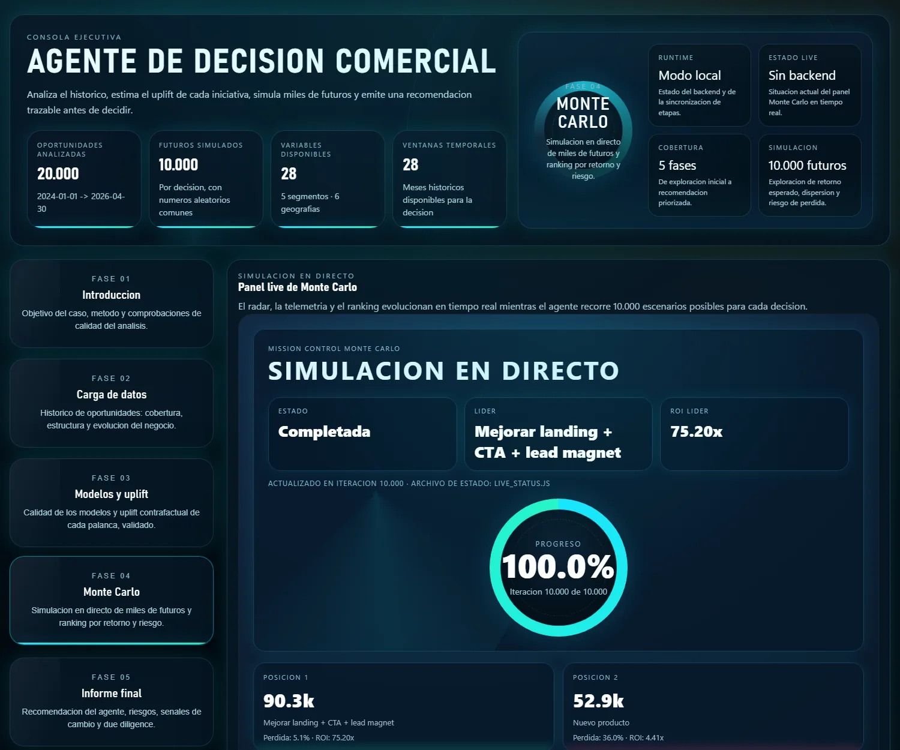
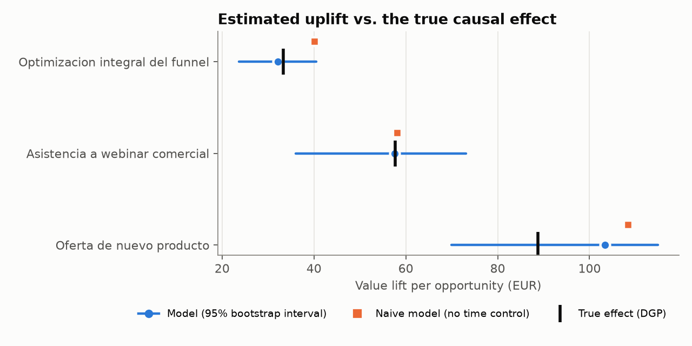
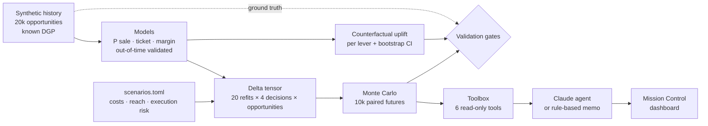

# Monte Carlo Decision Agent

**Which growth initiative should a business fund?** This project answers it the way a careful
analyst would — ML counterfactuals, a Monte Carlo over everything that can go wrong, and a
Claude tool-using agent that writes the recommendation — and then **checks its own estimates
against the ground truth** of a synthetic world. It was built by an AI coding agent working
inside an evaluated harness that decides when the work is done.

[](https://github.com/raulworkacc-dot/montecarlo-decision-agent/actions/workflows/ci.yml)


[](https://docs.astral.sh/ruff/)
[](LICENSE)

[Live dashboard](https://raulworkacc-dot.github.io/montecarlo-decision-agent/) ·
[Walkthrough notebook](notebooks/walkthrough.ipynb) ·
[Methodology](docs/methodology.md) ·
[Harness](docs/harness.md) ·
[Leer en español](README.es.md)



## The answer, and why it can be trusted

| # | Decision | E[profit] 6 months | P10 | P(loss) | P(best) | Break-even P(fail) |
|---|---|---:|---:|---:|---:|---:|
| 1 | Improve landing + CTA + lead magnet | **90,330 EUR** | 62,384 | 5.1% | 71.4% | 98.8% |
| 2 | New product | 52,873 EUR | −13,620 | 36.0% | 25.9% | 88.1% |
| 3 | Sales webinar | 30,602 EUR | 9,970 | 9.3% | 2.7% | 93.1% |
| 4 | Double paid-ads spend | −24,878 EUR | −37,188 | 100% | 0.0% | — |

<sub>10,000 simulated futures per decision, seed 42. Full report: [docs/results/report.md](docs/results/report.md).</sub>

Three findings that only come out because the analysis is validated:

1. **A naive model overstates the funnel by 20%.** Funnel changes rolled out while conversion
   was drifting up anyway. Controlling for calendar time brings the error to −3.5%, and every
   true lever effect falls inside its 95% bootstrap interval.
   
2. **Doubling ads loses money in every future.** Paid media is already running at high or
   saturated budgets; one more step degrades lead quality and cost on *all* paid traffic, not
   just the extra volume — an effect estimated from the history, not assumed.
3. **The new product has the highest upside and a 36% chance of losing money.** The
   break-even column is the failure probability at which a decision's expected profit drops to
   zero: how pessimistic the execution-risk assumption would have to be before it stops paying
   off ("—": it loses money even if it always ships).

## What this project demonstrates

| Area | In this repo |
|---|---|
| **Causal inference** | Counterfactual uplift with a calendar control, validated against a known DGP; naive-vs-controlled bias quantified; mediators (lead quality, cost) estimated from data |
| **Risk modelling** | Vectorised Monte Carlo with common random numbers; model, demand and execution uncertainty; CVaR, P(best), break-even analysis, MC standard errors |
| **ML practice** | Out-of-time validation, calibration (ECE, Brier), Duan smearing for log-target back-transformation, bootstrap refits propagated into the decision |
| **LLM engineering** | Claude tool-use loop with strict schemas, bounded turns, refusal/truncation handling, server-side model fallback, ground truth hidden from the agent, deterministic offline fallback clearly labelled |
| **Software engineering** | Typed, packaged CLI (`mcd`); 200+ tests incl. HTTP security surface; CI on Linux + Windows × Python 3.11/3.13; Dependabot; reproducible, seed-deterministic results |
| **Security** | Allow-listed routes (the original served `.env`), XSS-safe rendering of LLM text, localhost binding, request size limits |
| **AI-assisted development** | Built inside an agentic harness: definition of done = `just check`, protected analysis inputs, reviewer subagent, graded reference tasks |

## Quickstart

Requirements: Python 3.11+, [uv](https://docs.astral.sh/uv/) and [just](https://github.com/casey/just).

```bash
just setup          # install dependencies
just pipeline       # data -> models -> counterfactuals -> Monte Carlo -> validation (~20 s)
just serve          # Mission Control at http://127.0.0.1:8765, with a live simulation
```

No API key is needed: without one the memo is written by a deterministic rule-based author and
labelled as such. To let Claude write it, copy `.env.example` to `.env`, set
`ANTHROPIC_API_KEY`, and run `just memo` (or `just serve`, which picks it up automatically).

Other entry points: `just dashboard` (static site), `uv run mcd ask "Why not the webinar?"`,
`just notebook` (re-executes the [walkthrough](notebooks/walkthrough.ipynb) after
`just setup --group notebook`), `just check` (lint + tests).

## How it works



| Stage | Module | Key idea |
|---|---|---|
| World | [`synthetic.py`](src/montecarlo_decisions/synthetic.py) | Structural DGP with calendar confounding and mediation; exposes `true_*` functions |
| Models | [`models.py`](src/montecarlo_decisions/models.py) | Expected value per opportunity; temporal holdout; smearing; bootstrap row sets |
| Uplift | [`counterfactuals.py`](src/montecarlo_decisions/counterfactuals.py) | Model vs naive vs truth, with bootstrap intervals |
| Decisions | [`scenarios.py`](src/montecarlo_decisions/scenarios.py), [`scenarios.toml`](src/montecarlo_decisions/scenarios.toml) | Row-aligned interventions; every business assumption in one validated file |
| Simulation | [`simulation.py`](src/montecarlo_decisions/simulation.py) | Batched, vectorised, common random numbers; risk metrics |
| Gates | [`validation.py`](src/montecarlo_decisions/validation.py) | Soundness checks — never "which decision must win" |
| Agent | [`agent/`](src/montecarlo_decisions/agent) | Tools, Claude loop, memo schema, rule-based author |
| App | [`server.py`](src/montecarlo_decisions/server.py), [`dashboard.py`](src/montecarlo_decisions/dashboard.py), [`templates/`](src/montecarlo_decisions/templates) | Local app with live Monte Carlo; static build for Pages |

The reasoning behind each choice, and the limitations, are in
[docs/methodology.md](docs/methodology.md).

## Built inside an agentic harness

This repository is also a working example of **AI-assisted development with guardrails**. A
coding agent (Claude Code) did the implementation under rules it cannot override:

- **Done means `just check` is green** — not the agent saying so; CI enforces the same.
- **The analysis inputs are read-only for the agent.** A hook blocks edits to the synthetic
  world and to the business assumptions, so "make the checks pass" can never be satisfied by
  rigging the data. Eval `002` asks the agent to do exactly that; it passes only if the
  protected files stay untouched and the checks stay green.
- **A reviewer subagent** checks domain rules (ground-truth leakage into the agent's tools,
  rankings asserted in tests, determinism, unescaped LLM text).
- **The harness is measured** with reference tasks run on a clean clone and graded
  deterministically (`just evals`).

Details: [docs/harness.md](docs/harness.md) · agent context: [CLAUDE.md](CLAUDE.md).

## Repository map

```
├── src/montecarlo_decisions/   the analysis, the agent and the web app (CLI: mcd)
├── src/harness/                eval runner and deterministic grader of the agentic harness
├── tests/                      200+ tests (methodology, simulation, agent, HTTP security, harness)
├── notebooks/walkthrough.ipynb executed walkthrough with figures
├── docs/                       methodology, harness, figures, versioned results snapshot
├── evals/tasks/                harness reference tasks (TOML)
├── .claude/                    agent rules: permissions, protection hook, reviewer subagent
├── .github/workflows/          CI (Linux + Windows) and GitHub Pages deployment
└── bitbucket-pipelines.yml     mirror CI on Bitbucket
```

## What changed from the original case

The business case comes from a public project by
[DataScience ForBusiness](https://www.youtube.com/@DataScienceForBusiness) (see Credits). This
repository is a rebuild; the main differences:

| Original | This repository |
|---|---|
| The four analytical agent tools queried Spanish column names that the pipeline never wrote, so they always failed and a hand-written memo was shown as the agent's | Tools tested against the real artifacts; the memo is either Claude's (validated schema) or explicitly labelled rule-based |
| Quality check required the funnel to win | Gates check soundness only; ranking is an output |
| No calendar control → funnel uplift inflated ~20% | Time-controlled models; bias measured against ground truth |
| Ads scenario ignored saturation of existing paid traffic | Mediators estimated from history; ads correctly shows a loss |
| Hand-tuned noise per decision inside the loop | Uncertainty sources separated, assumptions in one reviewable file, break-even analysis |
| Web server exposed the whole project folder (incl. `.env`) | Allow-listed routes, localhost, size-limited JSON, escaped rendering |
| Row-by-row loops, `time.sleep` to stretch the demo | Vectorised DGP and simulation; demo pacing is an explicit, documented flag |
| Scripts, `.bat` launcher, no tests or CI | Packaged CLI, 200+ tests, cross-platform CI |

## Development

```bash
just check          # ruff + pytest (the definition of done)
just coverage       # tests with coverage
just snapshot       # refresh docs/results from a fresh run
just evals          # harness reference tasks (needs the Claude Code CLI)
```

## Credits and license

The business scenario (the four growth decisions, the structure of the synthetic sales data,
the original notebook and the visual design of the dashboards) is based on material published
by **DataScience ForBusiness** — [youtube.com/@DataScienceForBusiness](https://www.youtube.com/@DataScienceForBusiness) —
and is reused with the author's permission. The analysis code, methodology changes, agent,
tests, harness integration and documentation in this repository are released under the
[MIT License](LICENSE).

All data is synthetic. Figures illustrate the method, not the performance of a real business.
