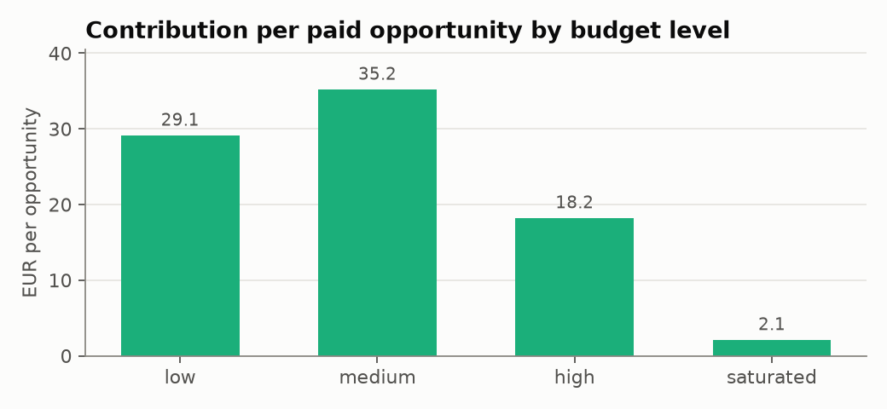
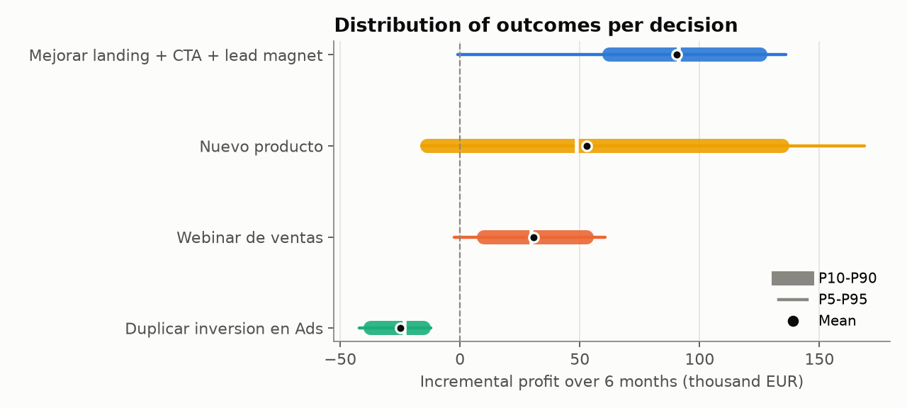

# Methodology

This document explains how the recommendation is built, why each design choice was made and
where the approach stops being reliable. Numbers quoted here come from the versioned snapshot in
[`docs/results`](results/report.md) (seed 42); regenerate them with `just snapshot`.

## 1. The question

A digital-marketing business can fund one initiative over the next six months:

| Decision | What changes | Fixed cost |
|---|---|---|
| Improve the funnel | landing v2 + benefit CTA + lead magnet + simplified checkout for every opportunity | 1,200 EUR |
| Sales webinar | 62% of warm, not-yet-invited leads are invited; 34% of them attend | 2,500 EUR |
| Double paid ads | every paid opportunity moves one budget level up; paid volume +70% | 9,000 EUR |
| New product | 32% of eligible leads get a higher-ticket offer | 12,000 EUR |

"Best" means highest **expected incremental contribution profit**, read together with its
downside (P10, CVaR 5%, probability of loss) and with how sensitive it is to the assumptions.

## 2. Why synthetic data, and why that is a feature

The history is generated by a structural data-generating process (DGP) in
[`synthetic.py`](../src/montecarlo_decisions/synthetic.py): covariates are sampled first, then
outcomes are drawn from explicit functions of those covariates. The same functions are exposed as
`true_conversion_probability`, `true_expected_aov`, `true_expected_margin` and
`true_expected_value`, so every counterfactual estimate can be compared with the **real causal
effect** — something no real dataset allows.

Two features of the DGP make the problem non-trivial on purpose:

- **Calendar confounding.** Funnel changes were rolled out over time (landing v2 from Sep 2024,
  CTA and lead magnet from Mar 2025, checkout from Aug 2025) while baseline conversion also drifts
  upwards by 0.004 logit per month. Any model that ignores time credits part of the drift to the
  funnel.
- **Mediation through lead quality.** Higher paid-media budgets lower the lead score (audience
  saturation) and raise cost per opportunity. The effect of spending more on ads therefore flows
  partly through variables that are themselves predictors.

The DGP is listed in `.claude/protected_paths.json`: the coding agent cannot edit the "world" to
make a preferred decision win (see [harness.md](harness.md)).

## 3. Models

```
expected value per opportunity = P(sale) × E[ticket | sale] × E[margin] − acquisition cost − P(sale) × support cost
```

| Component | Model | Notes |
|---|---|---|
| `P(sale)` | Logistic regression (one-hot categoricals, standardised numerics) | Includes `month_index` as a calendar control. Excludes acquisition cost and daily spend: they do not cause a sale, and a scenario that changes a cost must not move the predicted conversion. |
| `E[ticket \| sale]` | Histogram gradient boosting on `log(ticket)`, native categorical splits | Back-transformed with **Duan's smearing estimator**: `exp(E[log y])` underestimates `E[y]`. |
| `E[margin]` | Linear regression on channel + new-product flag | Margin is structurally additive in the DGP. |

**Validation is out of time**: models are trained on the oldest 80% of opportunities and scored
on the most recent 20% (Jan–Apr 2026), which is how they are used — to extrapolate forward.
Out-of-time AUC 0.713, Brier 0.106, expected calibration error 0.013; ticket R² 0.79.

## 4. Counterfactual uplift

For each lever, the opportunities it could apply to are copied, the treatment is forced
(e.g. `landing_variant = "landing_v2"`) and the models re-predict. The uplift is the mean
difference in expected value on **the same opportunities** — a delta, not a forecast.

Three estimates are reported side by side
([`counterfactuals.py`](../src/montecarlo_decisions/counterfactuals.py)):

| Lever | Model (95% bootstrap CI) | True effect | Naive model (no time control) |
|---|---|---|---|
| Funnel | 32.1 [23.6, 40.5] EUR | 33.3 EUR | 40.1 EUR (**+20% bias**) |
| Webinar | 57.5 [36.0, 73.1] EUR | 57.7 EUR | 58.2 EUR |
| New product | 103.4 [70.0, 114.9] EUR | 88.7 EUR | 108.4 EUR |


- The calendar control removes the funnel bias (error −3.5% vs +20.5%). This is the main
  methodological correction over the original project, whose model had no time control.
- The recovery gate is **coverage, not point accuracy**: the true effect must lie inside the
  bootstrap interval. The new-product estimate is 16.5% high, but it rests on ~550 historical
  offers from the last seven months and its interval says so.
- Intervals come from 20 bootstrap refits of all three models. Each refit is also reused by the
  Monte Carlo (next section), so estimation error propagates into the decision.

## 5. The ads scenario: mediators estimated from data

Moving a paid opportunity from `medium` to `high` budget changes its lead score and cost. The
size of those shifts is **not assumed**: it is the historical difference in mean lead score and
mean cost between budget levels among paid opportunities
(`scenarios.estimate_ads_response`).



In the recent window, most paid traffic already runs at `high` or `saturated` levels. One more
step lowers the expected value of every existing paid opportunity (≈32 → ≈14 EUR in the model,
≈32 → ≈13 EUR in the DGP) faster than +70% volume compensates. The original project modelled only
the *extra* opportunities and missed the degradation of the existing ones, which is why it
reported +31k EUR for this decision instead of a loss.

## 6. Monte Carlo

Each simulated future ([`simulation.py`](../src/montecarlo_decisions/simulation.py)) draws:

1. **Model uncertainty**: one of the 20 bootstrap refits.
2. **Opportunity mix**: a multinomial resample of the planning base (opportunities since
   Oct 2025, scaled to six months of volume ≈ 5,360 opportunities).
3. **Demand**: a volume shock (CV 10%).
4. **Execution risk**, independently per decision: failure (ships nothing, cost is sunk),
   realisation of the estimated effect (lognormal), and fixed-cost overrun (lognormal).

Steps 1–3 are **common random numbers**: every decision is evaluated on the same draw, so the
comparison between decisions is paired and the ranking is not an artefact of sampling noise.
Stochastic rollouts (who gets invited) are integrated analytically rather than sampled, and
per-opportunity Bernoulli noise is not simulated: over thousands of opportunities it adds little
variance to the *incremental* profit. The simulation is vectorised in batches (10,000 futures ×
4 decisions in ~3 s).



Reported per decision: mean, P5–P95, **CVaR 5%** (mean of the worst 5% of futures), probability
of loss, **probability of being the best option** (from the paired draws), ROI as a ratio of
means, Monte Carlo standard error, and the **break-even failure probability**: the failure
probability at which the expected profit would be zero, i.e. how wrong the execution assumption
would have to be before the decision stops paying off.

## 7. Business assumptions live in one file

Everything the data cannot tell — fixed costs, rollout reach, execution risk — is in
[`scenarios.toml`](../src/montecarlo_decisions/scenarios.toml), with a one-line rationale per
decision and validation on load. The execution-risk parameters are judgement calls (e.g. a 35%
failure probability for an unproven product). They are exposed to the agent, shown next to each
distribution, and summarised by the break-even failure probability so a reader can challenge
them. The file is protected from the coding agent for the same reason as the DGP.

## 8. Quality gates

A run passes only if ([`validation.py`](../src/montecarlo_decisions/validation.py)):

| Gate | Criterion |
|---|---|
| `data_integrity` | unique ids, binary outcome, non-negative costs, ticket present iff sale, attendance ⊆ invitation |
| `conversion_model_discrimination` | out-of-time AUC ≥ 0.68 |
| `conversion_model_calibration` | expected calibration error ≤ 0.03 |
| `counterfactual_recovery` | every true lever effect inside its 95% bootstrap interval |
| `ranking_resolved` | paired gap between #1 and #2 ≥ 3 Monte Carlo standard errors |

None of the gates checks *which* decision wins. The original project asserted that the funnel had
to rank first; that turns the conclusion into an acceptance criterion and was removed.

## 9. The agent

The memo is written by Claude through a tool-use loop over six read-only tools
([`agent/tools.py`](../src/montecarlo_decisions/agent/tools.py)): business baseline, lever uplift
with its interval, ads regimes, per-decision distribution with its assumptions, the ranking and
the validation gates. The tools deliberately **hide the ground truth** (`true_*` and `naive_*`
columns): the agent has to reason from estimates, as it would with real data. The memo is
submitted through a strict-schema tool, validated, and tied to a fingerprint of the results it
was written for, so a stale memo is never shown next to new numbers.

Without an API key, a deterministic memo calls the same tools and fills a fixed template. The UI
labels which author produced the text.

## 10. Limitations

- **Synthetic world.** The ground truth makes validation possible, but the business itself is
  invented. The method transfers; the numbers do not.
- **Correct specification helps the models.** The DGP's conversion logit is additive, so a
  logistic regression is well specified. On real data, misspecification would add bias that the
  bootstrap does not capture.
- **No unmeasured confounding.** Time is the only confounder in the DGP and it is observed. With
  real data, randomised experiments (or at least a design that addresses selection) would be
  needed to trust counterfactual uplift.
- **Execution risk is judgement.** The spread between decisions depends materially on
  `failure_probability` and `realization_sd`. The break-even column bounds how much, but these
  inputs should come from people who have run such initiatives.
- **Single horizon, no interactions.** Decisions are evaluated separately over six months; the
  combined effect of funding two levers, learning effects and longer-term value (e.g. customer
  lifetime) are out of scope.
- **Percentile bootstrap with 20 refits** gives approximate intervals: the 2.5th/97.5th
  percentiles are close to the minimum and maximum refit. Refits are evaluated on a fixed
  subsample of at most 5,000 opportunities per lever, while the point estimate uses the full
  history, so an interval is not necessarily centred on its estimate. More refits would tighten
  the tails at a linear cost in run time.
